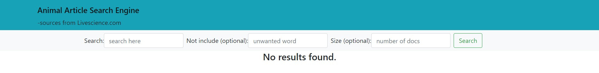
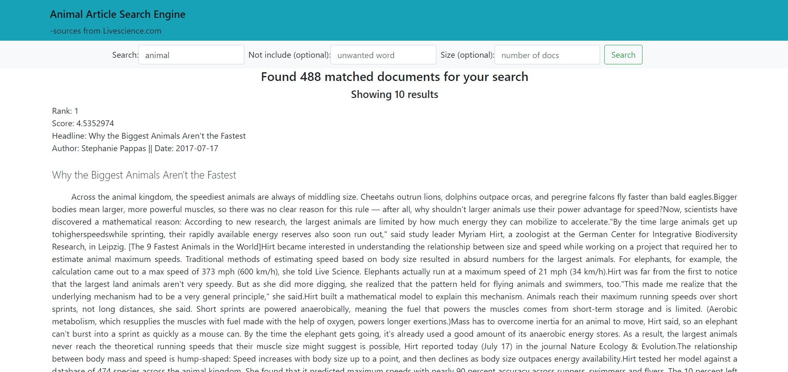
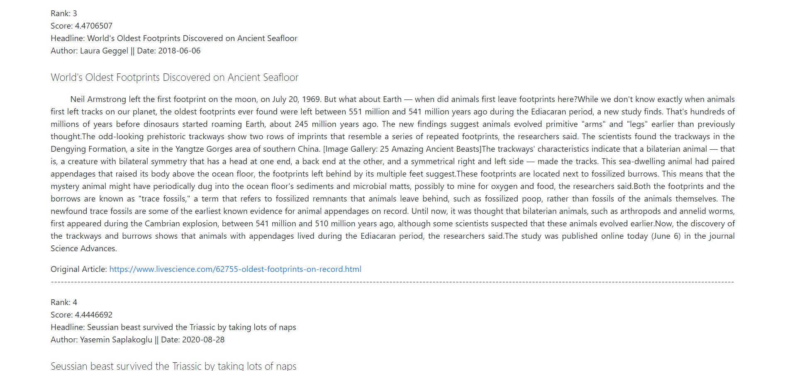
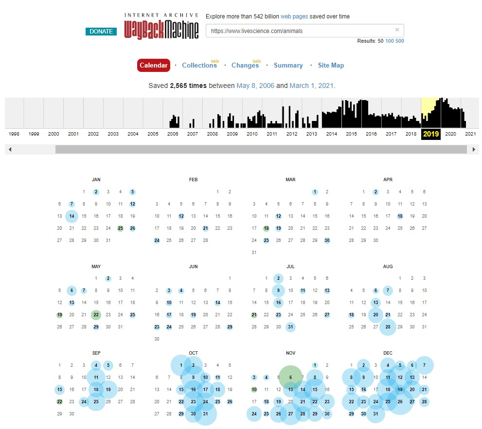
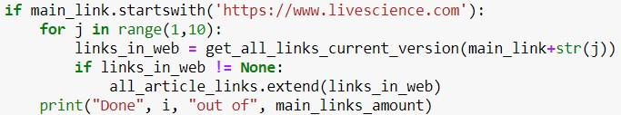
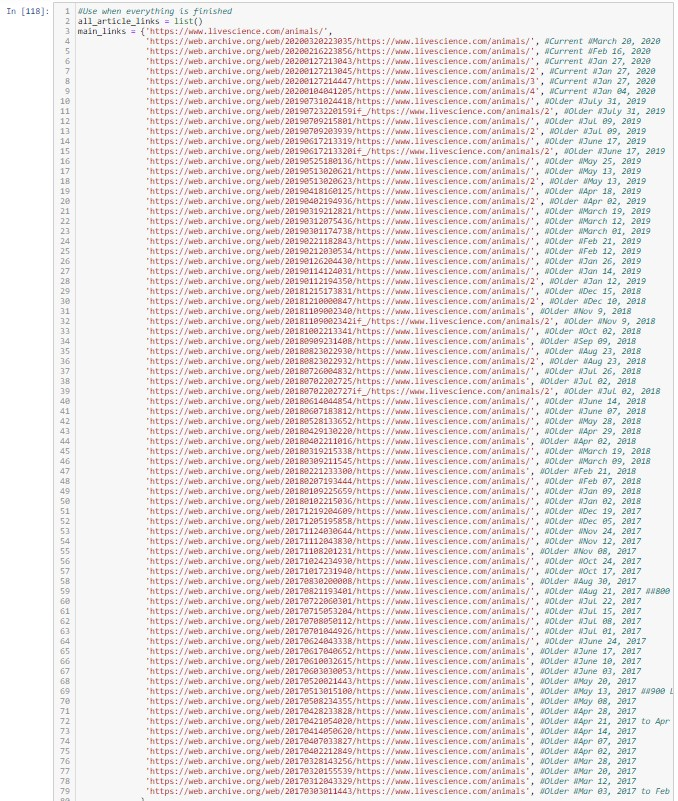

# Animal Articles Search Engine
## What's the problem we are trying to solve?
&nbsp;&nbsp;&nbsp;&nbsp;The problem we are trying to solve is many websites that integrate the animal article
are having the non-animal related articles too. That could make the search engine not
efficient and show a lot of animal-unrelated articles or information. Moreover, some websites
show the information from unreliable sources and sometimes those articles are outdated.
Therefore, we created the search engine that works specifically for animal-related articles
which are published by reliable websites and authors. We retrieved more than <b>900+</b> articles
from 2017 to November, 2020 which is to make sure our search engine has only the latest and
fresh articles.  
**Note that this is our prototype, so we don't focus much on good look.

## What's the source of article and how can we know whether it's reliable?
&nbsp;&nbsp;&nbsp;&nbsp;We gathered the articles from www.livescience.com by doing web scraping with <b>BeautifulSoup</b>. This website published various types of news, not just animals but all other science related news. But for this project we focus only Animal articles. <b>Livescience</b> have over <b>1.5M</b> followers all across platforms and they always cite their articels. This can make sure of their credibility.

## Tools we use
* Elasticsearch (for search engine)
* Django web framework (for web application)
* BeautifulSoup package (for web scraping)

## Processes
1. Find the main pages that contain many links and scrape all of the links
2. For each link we get, scrape them one-by-one at the runtime and save to a variable
3. Preprocess all articles
4. Save preprocessed data/articles to Elasticsearch
5. Create the web application with Django and use elasticsearch-dsl module to connect to Elasticsearch
6. Test and done!

## Results
&nbsp;&nbsp;&nbsp;&nbsp;This is the main page before do searching. We have 3 search boxes; 1st one is compulsory, the rest are optional. The first box is what users want to search. The second one is the words users don't want to include in the search results, and the last one are maximum numbers of results users wish to see.

  
&nbsp;&nbsp;This is the result when users input the search boxes. Each article contain rank which is ordered respected to the score with Elasticsearch's Algorithm <b>(BM25)</b> and article's metadata.
  
  
&nbsp;&nbsp;We formatted the data very clean and eye-pleasing look. At the end of each article, we puts the original link to the article and puts the separate line for making it easier to read.
  

## Problems we found during this project
1. Pick-off-the-shelf web scraper doesn't work. This is because for each website, if we want specific information (in this case, article and metadata) rather than links, the code need to be customized for those website.
2. Scraping specific text parts from the website is surprisingly hard. Because the approach bs4 use to scrape is to find the tag and the tag for text is 
 tag. This tag is all over the pages including ads and a lot of unrelated contents. So, it requires extra works to get things done ex. using regex.
3. The main website of livescience provide only 9 latest pages (there is archive pages, but there are mix of links rather than only animals), and each page has only 20 articles links, That's totally only 180 which is not enough for us. So we need to use web.archive.org to go back in time and scrape from the older links.

  
&nbsp;&nbsp;&nbsp;&nbsp;From the current version of websites we can scrape 9 pages in 1 go very easily because the links are fixed with page number. So this block of code do the job for us.  

  
&nbsp;&nbsp;&nbsp;&nbsp;But for those links from web.archive.org, they are randomly generated. There are no pattern we can use. So, we have to manually copy-paste one by one. Each link from the older version of the website contain only 10 links. We have to copy-paste a lot of them

  

## How to run  
1. Install all of the python modules using in the project (I provided elasticsearch modules folder within Elasticsearch_Jupyter_Notebook folder)
2. Open main.ipynb in Elasticsearch_Jupyter_Notebook folder
3. Run all cells (This might take about 1 hour and 15 minute in the web scraping part because the program will access all 944 links at runtime.)
4. Open Command line and cd to folder searchsite
5. Inside searchsite folder, type "python manage.py runserver"
6. Open the internet browser and enter localhost:8000 
7. Ready to go!

## What to improve?
- Save the output from web scraping in another file (pickle or json)
- More function on search bars (type correction, suggestion, auto-complete, etc.)
- Better looking UX/UI
- More Data
  
***For full detail about this project, please take a look at Animal_Articles_Search_Engine.pdf PLease ignore the first page, it is for the course submission at our university.***
  
# Thank you for reaching out and Read to the end. You are AMAZING. :D
